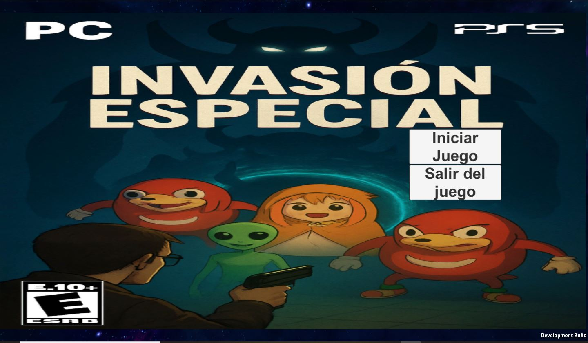
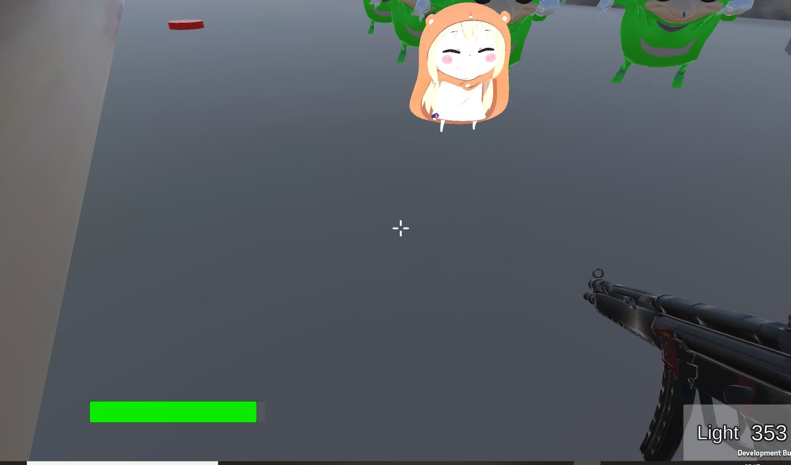
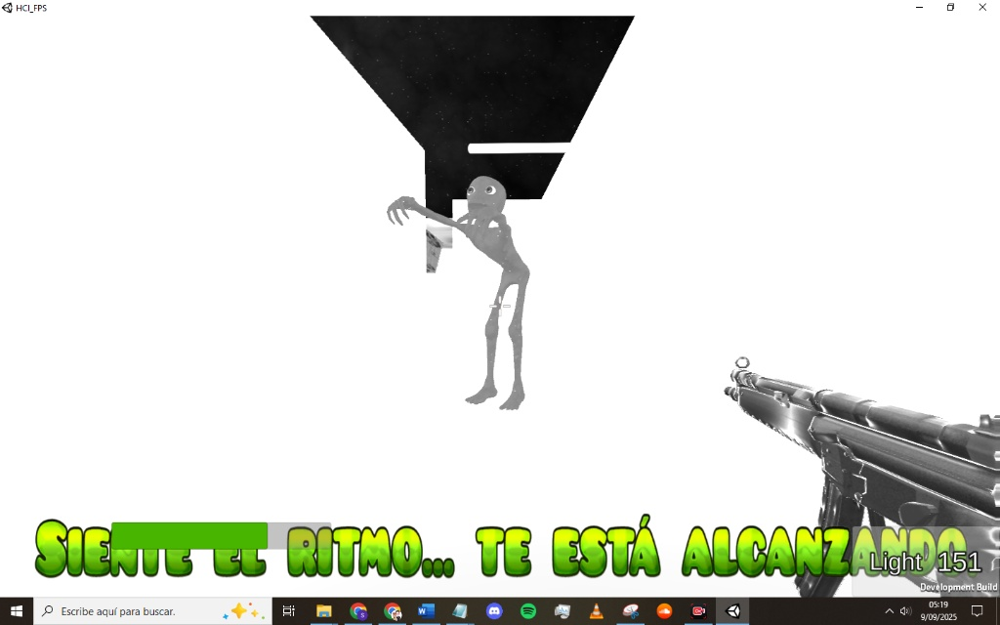
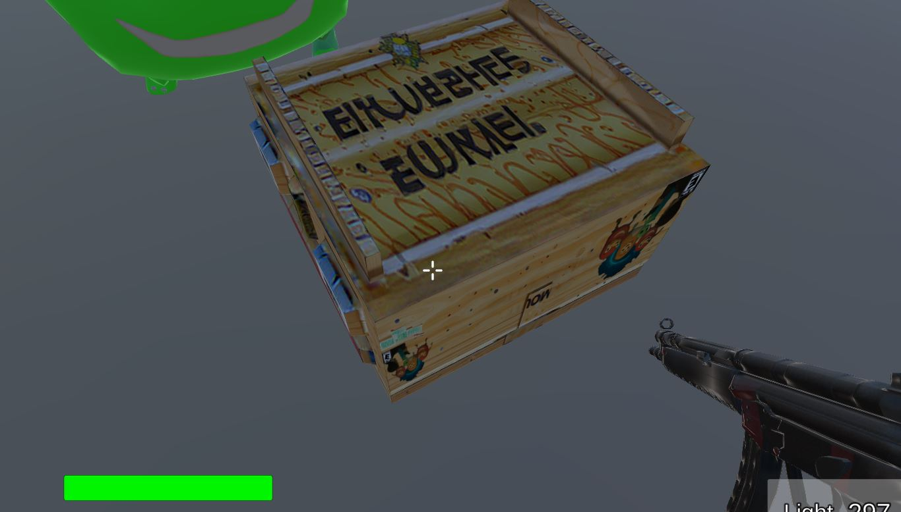
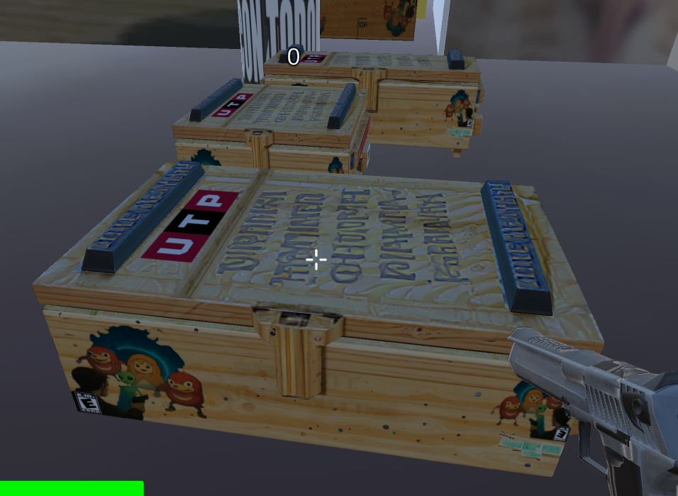
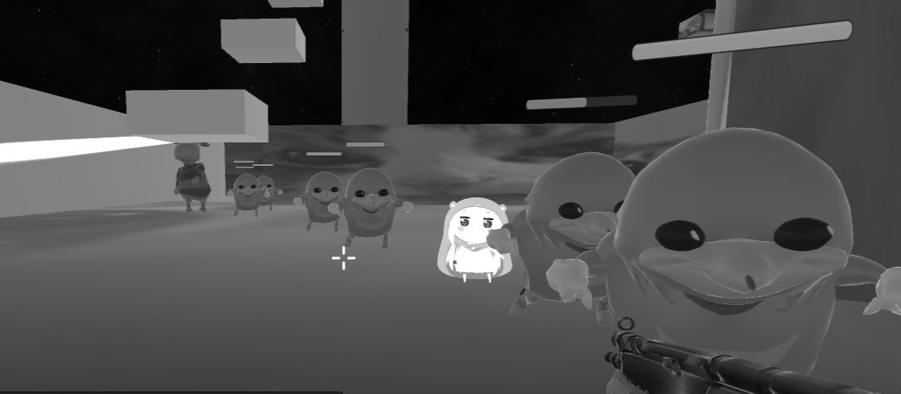

# 🔫 Space Invaders 3D — Unity + Partículas+Assets Personalizadas

**Resumen:**
En el año **2049**, el científico **Dr. Elías Vértice** abre por error un **portal al “subconsciente de Internet”**.
De este reino surgen **memes olvidados y datos corruptos**, dando vida a **seres mutados y absurdos**.
Enemigos virales como **Ugandan Knuckles, Umaru-Chan y Dame Tu Cosita** emergen para destruirlo.

Atrapado en su laboratorio, el jugador deberá **enfrentar oleadas de enemigos**, recolectar **fragmentos de código**, y cerrar el **Quantum Nexus** antes de que estas entidades consuman la realidad.

**Tecnologías:** Unity · C# · Assets personalizados · Sistema de partículas VFX

---

## 🎥 Demo (capturas / gif)

---

## ✨ Mecánicas de Juego

### 🎮 Jugabilidad en primera persona

* Perspectiva **FPS**: el jugador ve el arma low-poly en pantalla.
* **Armas con munición limitada**, obligando a jugar con estrategia.
* **Cajas de munición** que aparecen de forma aleatoria.
* **Oleadas progresivas**: cada nivel trae más enemigos, más rápidos y más difíciles.
* **Recompensas dinámicas**: cada 10 enemigos derrotados aparece un **paquete de recursos**, acompañado de un **audio especial**.
* **Exploración y combate**: mapas con zonas elevadas, laberintos y escondites de suministros.

---

### 🧾 HUD dinámico

* **Nivel actual** (ej. Nivel 1).
* **Enemigos restantes** en pantalla.
* **Puntaje en tiempo real**.
* **Vidas del jugador**.

---

### 👾 Enemigos

| Tipo             | Apariencia            | Comportamiento                        |
| ---------------- | --------------------- | ------------------------------------- |
| Ugandan Knuckles | Modelo viral low-poly | Enemigo base, movimientos absurdos    |
| Umaru-Chan       | Mini enemigo (minion) | Rápido y molesto, ataca en grupos     |
| Dame Tu Cosita   | Verde fosforescente   | Enemigo élite, movimientos extraños   |
| Tyrunt (Boss)    | Gigante mutado        | Jefe final con fases y ataques únicos |

---

### 🌌 Estética y Humor

* **Animaciones absurdas** para jugador y enemigos.
* **Visuales caóticos** con partículas coloridas, señales claras y explosiones graciosas.
* **Audio cómico**: sonidos virales y efectos divertidos.
* **Armas poco convencionales** con un diseño intencionalmente ridículo.
* **Enemigos “virales”** que mezclan humor y reto.

---

## 📖 Manual de Juego

### 🎮 Controles

| Tecla / Botón     | Acción                                 |
| ----------------- | -------------------------------------- |
| ⬅️ / ➡️ / ⬆️ / ⬇️ | Movimiento del jugador (WASD opcional) |
| Ratón (clic izq)  | Disparo con rifle de asalto            |
| Ratón (mover)     | Apuntar con la mira                    |
| ESC               | Pausa / Menú                           |

---

## 📦 Estado del Proyecto

✅**Prototipo jugable en Unity (FPS, oleadas y enemigos virales)**
Incluye HUD, armas, progresión de niveles y enemigos con estética absurda.

❌ **Ejecutable en el repo:** La versión incluida (`SpaceInvaders.exe`) está **rota** y no funciona correctamente.

✅ **Versión oficial y funcional:**
👉 Debes descargar directamente desde la **release oficial** aquí:

📥 **[Descargar Space Invaders 3D — Release oficial (.exe)](https://github.com/Gabrielce992/invasion-espacial-demo/releases/tag/v1.0)**

---

## 📂 Estructura del repo

* ❌ `SpaceInvaders.exe` → Ejecutable roto, no funcional.
* ❌ `UnityPlayer.dll` → Asociado a la versión rota.
* ❌ `UnityCrashHandler64.exe` → Asociado a la versión rota.
* `assets/` → Carpeta auxiliar (incluye `.gitkeep`).
* `README.md` → Documentación del proyecto (este archivo).

---

## 🔒 Código

El proyecto completo (código en C# y assets de Unity) se encuentra en un **repositorio privado**.
**Acceso al código:** disponible bajo solicitud (se puede otorgar acceso al repo privado).

📧 Contacto: **[tu.email@ejemplo.com](mailto:tu.email@ejemplo.com)**

---

